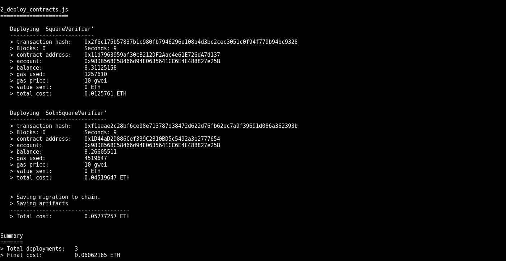
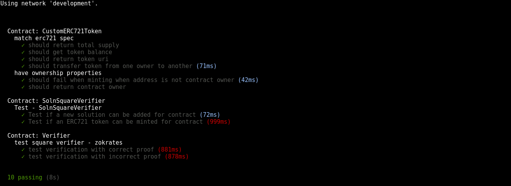

# Udacity Blockchain Capstone

In this project a real estate marketplace problem is addressed. Therefore, minting your own tokens to represent your title to the properties, is enabled. Before you mint a token, you need to verify you own the property. To this end, zk-SNARKs are used to create a verification system which can prove you have title to the property without revealing that specific information on the property.

#### Contract 'SquareVerifier'
contract address: 0x11d7963959af30cB212DF2Aac4e61E726dA7d137

#### Contract 'SolnSquareVerifier'
contract address: 0x1D44aD2D886Cef339C2810BD5c5492a3e2777654

The contracts' addresses are shown in the following image.


## Getting Started
To install this project, download or clone the repo, then:
```
npm install
```
Start Ganache with the following command:
```
ganache-cli -m "candy maple cake sugar pudding cream honey rich smooth crumble sweet treat" -l 20000000000 -a 50
```
Then compile and migrate in order to deploy the contracts:
```
truffle compile
truffle migrate --network development
```
## Testing
Test the contracts by invoking the command. In order to test a local blockchain should be already deployed with Ganache.
```
truffle test
```


# Project Resources

* [Remix - Solidity IDE](https://remix.ethereum.org/)
* [Visual Studio Code](https://code.visualstudio.com/)
* [Truffle Framework](https://truffleframework.com/)
* [Ganache - One Click Blockchain](https://truffleframework.com/ganache)
* [Open Zeppelin ](https://openzeppelin.org/)
* [Interactive zero knowledge 3-colorability demonstration](http://web.mit.edu/~ezyang/Public/graph/svg.html)
* [Docker](https://docs.docker.com/install/)
* [ZoKrates](https://github.com/Zokrates/ZoKrates)
